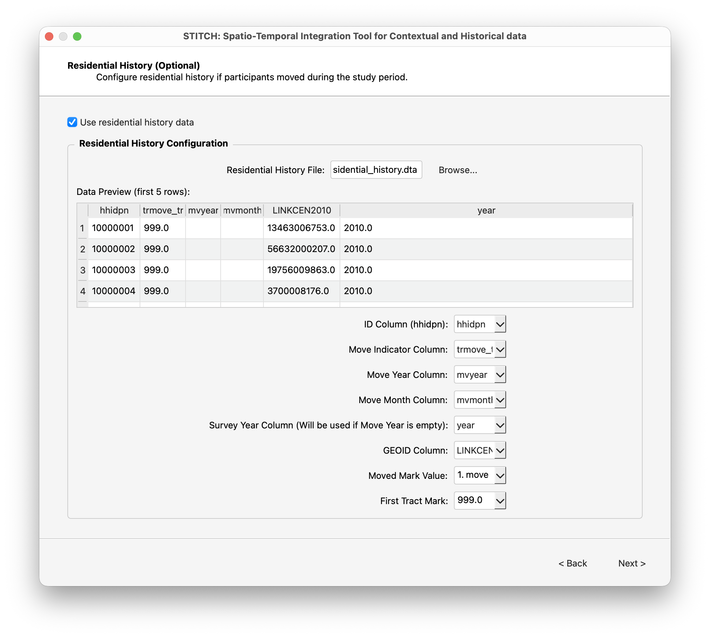
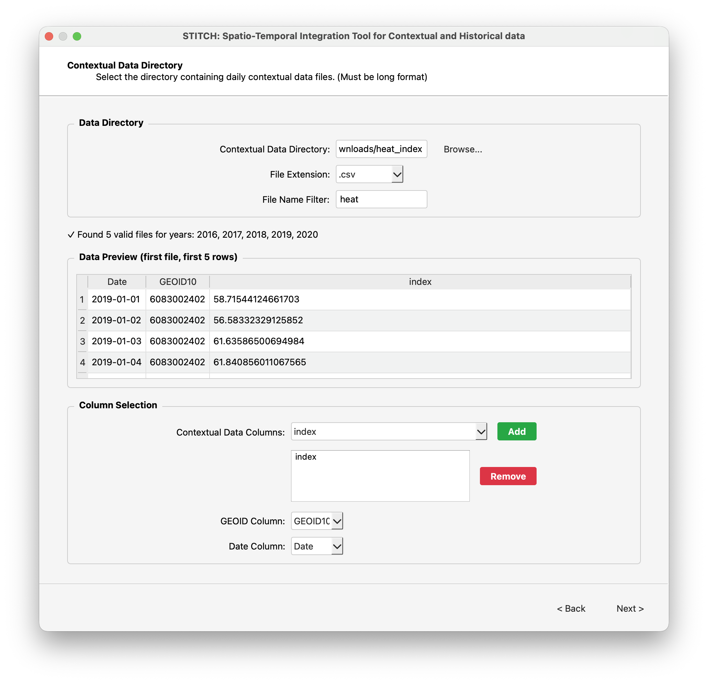
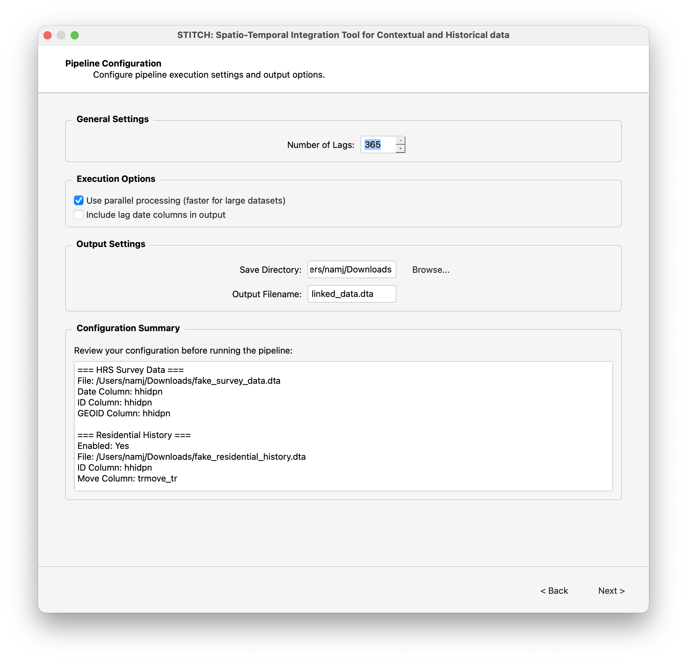
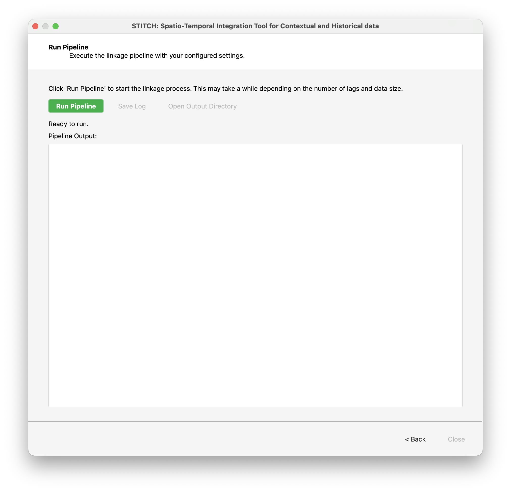

# Summary

STITCH is a Python-based framework for linking diverse data sources across geospatial and temporal dimensions, enabling the enrichment of individual-level observational data with contextual and historical information. Primarily motivated to augment the Health and Retirement Study (HRS) [@universityofmichiganWelcomeHealthRetirement], the largest ongoing nationally representative survey in the United States, with spatiotemporal data (e.g., air quality, weather, neighborhood characteristics), STITCH is designed to efficiently link large-scale spatiotemporal datasets to individual survey participants based on their reported geographic locations (e.g., census tract FIPS codes, ZIP codes). It also supports the integration of participants’ residential histories, enabling accurate linkage of contextual data to periods of residence and relocation. Designed for local deployment, STITCH provides a reproducible and user-friendly solution for spatiotemporal data integration.

# Statement of need

High-resolution spatiotemporal data allow researchers to better understand longitudinal trajectories in survey-based studies by precisely situating participants within their environmental and historical contexts. For example, by linking the Health and Retirement Study (HRS) to daily heat index values at participants’ reported residences, @choiAmbientOutdoorHeat2025 showed that exposure to extreme heat accelerates biological aging as measured by blood-based epigenetic markers. As these data become higher in spatial and temporal resolution, they also become larger—often exceeding 10 GB—which makes both processing and linkage increasingly difficult to perform efficiently.

To obtain data linked to high-resolution spatiotemporal sources, researchers have traditionally had to: (1) write their own scripts in their preferred programming language; (2) adapt someone else’s linkage code; or (3) rely on colleagues to share already-linked data. Although languages such as Python, R, and Stata offer tools for merging datasets, merging multiple sources with precise time lags, while properly handling events such as residential moves, quickly becomes a challenging task for researchers who are not experienced in complex data management.

Sharing already-linked data is another option, but it rarely meets broad needs. Different research questions require linkage to different contextual datasets, so a single pre-linked resource is unlikely to satisfy most users. The challenge is compounded by the fact that many survey-based studies contain sensitive residential information and therefore can only be accessed on network-restricted computers. Linked data often cannot be transferred or removed without formal approval.

To address these challenges, we developed STITCH: an efficient, reproducible data-linkage pipeline that researchers can run securely in their own local computing environments. STITCH is implemented primarily in Python and is available in three forms to accommodate users with different levels of technical expertise: a packaged executable with a graphical user interface for those without programming experience; a command-line interface for users who prefer scripted workflows; and an open-source Python package for advanced users who wish to customize the pipeline. STITCH source code and compiled executables can be found at [https://github.com/njw0709/stitch](https://github.com/njw0709/stitch).

Although originally designed for survey-based applications, we note that STITCH can be used to efficiently link any smaller dataset containing time and location information to a larger spatiotemporal dataset aligned to the same dimensions.

# Overview of the data stitching pipeline

STITCH is a tool that efficiently performs multiple time-lagged merges between a smaller dataset and a high-resolution spatiotemporal dataset. For each temporal point of observation (e.g., an interview date), the relevant lagged contextual information is extracted and appended to the primary data as additional columns.

For example, if a user requests a 30-day history of air pollution prior to the interview date, STITCH calculates each lag from the participant’s interview date and retrieves the corresponding values. It then constructs variables such as air pollution on the interview day (0-day lag), 1-day prior air pollution, 2-day prior air pollution, and so on up to 30 days.
 
## Required data sources and their formats

STITCH takes in three types of data sources.

First, STITCH requires a primary dataset to which the contextual information will be linked. This dataset must include columns containing time information (e.g., interview date) and location information (e.g., an 11-digit census-tract-level FIPS code). If residential history is used, which is described next, an additional column with a participant ID is required.

| Participant ID | Interview Date         | Census Tract FIPS Code | Some Other Variable  |
| -------------- | ---------------------- | ---------------------- | -------------------- |
| 1              | March 2, 2023          | 12345678910            | Yes                  |
| 2              | February 17, 2023      | 67890123456            | No                   |
| 3              | January 30, 2023       | 23456789012            | Yes                  |

: **Example primary dataset.** Time and location information (e.g., interview date and census tract FIPS code) are used as keys to match the contextual data to the primary dataset.

Second, STITCH can optionally take a dataset containing residential histories. This dataset includes information about when and where participants moved. If no residential history is provided, the location information from the primary dataset is used for all time lags. An example is shown below.

| Participant ID | Moved Indicator   | Year | Month | Census Tract FIPS Code  |
|----------------|-------------------|------|-------|-------------------------|
| 1              | 999.0             | 2010 | 2     | 27503002857            |
| 1              | move              | 2011 | 1     | 31093008015            |
| 2              | 999.0             | 2010 | 3     | 25328004727            |
| 2              | move              | 2011 | 1     | 50262000210            |
| 3              | 999.0             | 2012 | 3     | 67890023156            |
| 3              | move              | 2013 | 4     | 31093008015            |
| 3              | move              | 2014 | 10    | 50262000210            |
| 3              | move              | 2016 | 1     | 98765391820            |

: **Example residential history dataset.** When a participant’s location changes over time, STITCH updates the location based on the relevant time point using the residential history dataset. If no location change is recorded, the location information from the primary dataset is used for all time points.

The residential history dataset must contain five columns: participant ID, moved indicator, year, month, and location. Participant IDs link residential histories to the corresponding rows in the primary dataset. The moved indicator specifies whether each row represents the participant’s initial entry into the study or a subsequent move. In the example above, 999.0 designates the entry point, and "move" indicates a residential change. Because the dataset is in long format, participants with multiple moves appear in multiple rows (e.g., participant 3).

Time information is separated into year and month to accommodate the common situation in survey-based studies where the exact month of a move is known but the exact day is not. If month information is missing, STITCH assumes the move (or study entry) occurred in January of that year.

Finally, STITCH requires the directory where contextual data are stored in the local environment. These data must be organized in yearly files that follow a consistent naming scheme. For example, daily air pollution data might appear as one CSV per year:

```text
PM2.5/
|-- 2010_daily_pm25.csv
|-- 2011_daily_pm25.csv
|-- 2012_daily_pm25.csv
|-- 2013_daily_pm25.csv
```

Each CSV must be in long format, with date, location, and measurement stored in separate columns.

| Date               | Census Tract FIPS Code | PM2.5     |
|--------------------|------------------------|-----------|
| January 1, 2010    | 12345678910            | X.X       |
| January 1, 2010    | 67890123456            | Y.Y       |
| ...                | ...                    | ...       |
| December 31, 2010  | 12345678910            | A.A       |
| December 31, 2010  | 67890123456            | B.B       |

: **Example contextual dataset.** Date and location information are used as keys to match the contextual data to the primary dataset.

Using the time and location information from the first two data sources, STITCH efficiently extracts rows from the contextual data with matching dates and FIPS codes and merges the resulting variables back into the primary dataset. We describe the general details of how the merging is performed in the next section.

## Summary of the processing pipeline
{#fig:pipeline}

Using the data sources described above, STITCH links contextual data to the primary dataset based on time and location information. \autoref{fig:pipeline} provides an overview of the STITCH processing pipeline.

STITCH first loads the primary dataset—and, if provided, the residential history dataset—into memory. Because contextual datasets are often too large to load in full, STITCH computes all required locations and time points from the loaded datasets and then reads only the necessary portions of the contextual data. This creates a filtered subset containing only the rows relevant for linkage.

After all required data are prepared, STITCH performs time-lagged merges between the primary dataset and the filtered contextual data. For each user-requested lag (e.g., 0–30 days before an interview date), STITCH calculates the corresponding time and location, extracts the matching contextual records, and writes the extracted subset to a temporary file. This procedure is repeated for each lag.

Once all lags have been processed, STITCH loads the temporary files and merges them with the primary dataset to produce the final enriched dataset. An example of the final merged output is shown below.


| Participant ID | Interview Date         | Census Tract FIPS Code | 0-day prior PM2.5  | 1-day prior PM2.5 | ... |
| -------------- | ---------------------- | ---------------------- | ------------------ | ----------------- | --- |
| 1              | March 2, 2023          | 12345678910            | X.X                | X.X               | ... |
| 2              | February 17, 2023      | 67890123456            | Y.Y                | Z.Z               | ... |
| 3              | January 30, 2023       | 23456789012            | K.K                | L.L               | ... |

: **Example final merged dataset.** For each participant, STITCH computes lagged time points and corresponding locations, extracts the matching contextual values, and merges them back into the primary dataset.

# User manual

We provide a brief user manual for STITCH's graphical user interface (GUI), to explain in detail about features supported by STITCH. We designed STITCH to be as flexible as possible, supporting a variety of use-case scenarios. Currently, STITCH supports a variety of data formats and file types, multi-column contextual data merging, and parallel processing for faster merging, as can be seen in with GUI.

Below are the configuration pages for STITCH-GUI, along with a brief description of each page.

1. **Base (survey/interview) dataset selection** 

{ #fig:gui_1 width=50% }

Here, user begins by browsing and selecting the base (survey/interview) dataset file (\autoref{fig:gui_1}). The file must be in a supported format (e.g., .dta, .csv, .parquet, .feather, .xlsx, .xls). STITCH-GUI then reads in the column information of the selected dataset to provide options for the dropdown menus below. User must specify: (1) date, or reference time column, (2) participant ID column, and (3) location identifier column. Location identifier column will be overridden if residential history dataset is provided in the next screen.

2. **Residential history dataset selection (Optional)** 

{ #fig:gui_2 width=50% }

If the user has a dataset containing residential history information, they can select it here (\autoref{fig:gui_2}). The dataset must be in a supported format (e.g., .dta, .csv, .parquet, .feather, .xlsx, .xls). STITCH-GUI then reads in the selected dataset to provide options for the dropdown menus below. User must specify: (1) participant ID column, (2) moved indicator column, (3) year column, and (4) month column. If month information is missing, STITCH assumes the move (or study entry) occurred in January of that year.


3. **Contextual data directory selection** 

{ #fig:gui_3 width=50% }

User must specify the directory where contextual data are stored in the local environment (\autoref{fig:gui_3}). These data must be organized in yearly files that follow a consistent naming scheme. If the directory contains multiple files, user must specify the file name filter to select the relevant files. For example, if a directory contains files like "heat_2010.csv", "heat_2011.csv", etc., as well as "pm25_2010.csv", "pm25_2011.csv", etc., user can use "heat" as file name filter to only select the heat files. STITCH uses the file name to determine the year of the contextual data. Therefore, the file name must contain a 4-digit year. If the file name does not contain a 4-digit year, STITCH will not be able to determine the year of the contextual data. 

Once a directory and file name filter are specified, STITCH-GUI displays a preview of one of the files in the directory. User can then select the columns to be used as (1) temporal information (e.g., date), (2) location identifier (e.g., census tract FIPS code).

A file can contain multiple columns of contextual data (e.g. raw temperature, heat index, etc.). In this case, STITCH allows user to add one or more columns to the contextual data columns list. All of the indicated columns will appear in the final merged dataset.

4. **Pipeline configuration**

{ #fig:gui_4 width=50% }

Once all data sources are selected and configured, user specifies the number of lags to compute (\autoref{fig:gui_4}). Currently, only daily lags are supported (i.e., 0-day prior, 1-day prior, 2-day prior, etc.). User can also choose to include the computed lag date columns and location columns in the final merged dataset. If the option is not selected, the computed lag date columns and location columns will be dropped and not appear in the final merged dataset.

For merges with many lags (e.g., 365 days), STITCH allows user to process merges in parallel. While this makes processing faster, it also requires more memory. STITCH automatically computes the maximum number of workers to use based on the available memory.

Finally, user must specify the output directory and filename. STITCH saves both temporary files and the final merged dataset to the specified output directory.

5. **Execution**

{ #fig:gui_5 width=50% }

Once all configuration is complete, user can click the "Run Pipeline" button to start the merging process (\autoref{fig:gui_5}). STITCH-GUI displays a real-time log window to monitor the progress of the merging process.

STITCH can also be run from the command line using the `stitch-cli.py` script. The script takes the same arguments as the GUI, but without the graphical interface. This allows users to configure and run the pipeline programmatically, which can be useful when running STITCH to merge multiple datasets in a batch.


# License
STITCH is released under the MIT License.

# Author contributions

## Conceptualization
Jennifer A. Ailshire, Eun Young Choi, and Jong Woo Nam conceptualized the idea of STITCH. 

## Software implementation
Jong Woo Nam wrote code for the software implementation of STITCH.

## Functionality testing
Eun Young Choi and Jong Woo Nam tested the functionality of STITCH in multiple scenarios, primarily on Windows machines.

# Acknowledgements
This work was supported by the USC/UCLA Center on Biodemography and Population Health through a grant from the National Institute on Aging, National Institutes of Health (P30AG017265).

# References